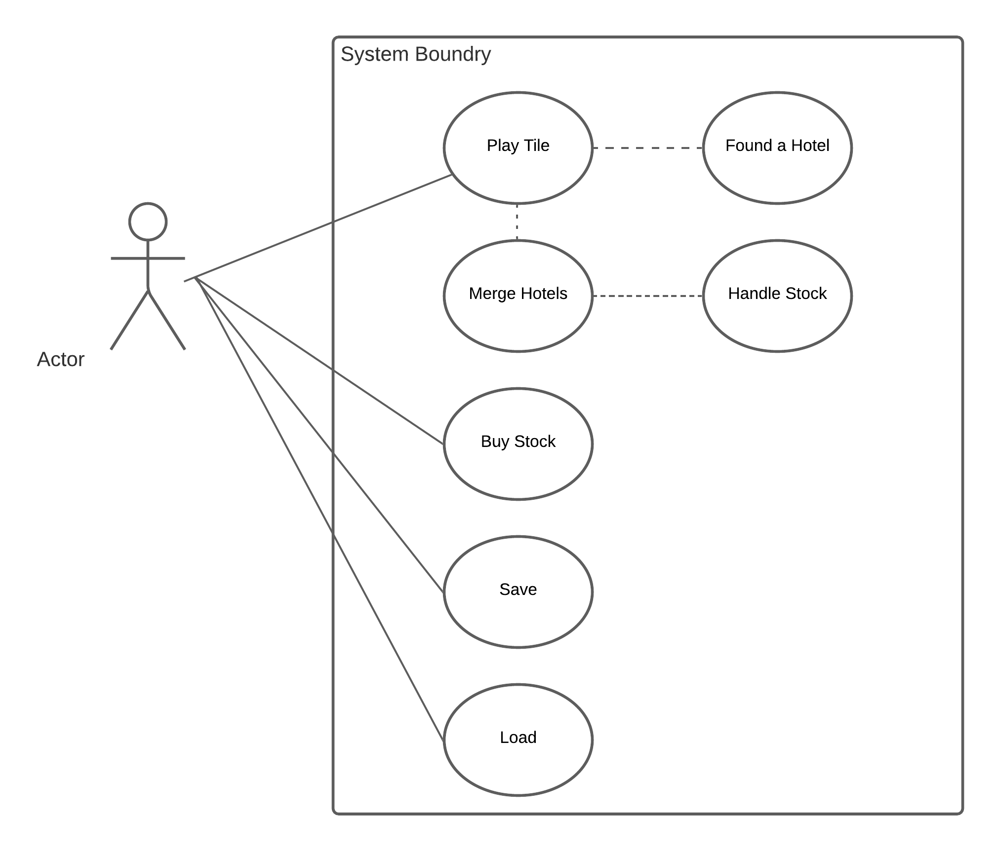

# System Analysis

## Use Cases

1.Play Tile
* Assuming actor has 6 tiles

| Actor  | System  |
|---|---|
| 1. Selects a tile to play  |   |
|   |  2. The system checks for adjacent tiles. If no adjacent tile is present, continue to Step 8, if a tile is adjacent, continue to Step 3.|
|   | 3. If the adjacent tile is not part of a hotel, found a new hotel. If it is part of a current hotel, continue to Step 6.|
| 4.Choose a hotel to found. |   |
|   | 5. System creates the hotel consisting of adjacent tile and placed tile, give player 1 free share of the new hotel, continue to step 8 |
|   | 6. If tile is adjacent to an already existing hotel, check if merge will occur, if there is no merge add tile to existing hotel.|
|7. End tile placement phase|   |

2.Merge Hotels

|Actor|System|
|---|---|
|   |1.If placed tile is adjacent to two or more hotels, begin merge.|
|   |2.The system checks which hotel is larger, the largest hotel aquires the smaller ones, continue to Step 5. If the hotels are the same size continue to Step 3.   |
|3. Merging Player: Choose which hotel will be aquired.|   |
|   |4.System merges the hotels according to the user's decision.   |
|   |5.System determines primary and secondary shareholders of aquired hotel. If a tie occurs for the primary shareholder, continue to step 6, if not continue to Step 7.   |
|   |6. System adds up the bonus for primary and secondary shareholders and split evenly to the nearest $100 to the two players tied for primary shareholder, continue to Step 9.   |
|   |7. If a tie occurs for the secondary shareholder, the system splits the bonus for the secondary shareholder between tied players and pay the primary the normal amount, continue to step #, if not continue to Step 9.   |
|   |8. System pays the primary and secondary shareholders according to bonus on the reference sheet, continue to Step 9.   |
|9. Each Player: Hold, sell, or trade stocks of the aquired hotel.   |   |
|10. If player chose to sell: enter number of stocks to sell   |   |
|   |11. System gives player cash per stock they sold according to the reference sheet. If player, has no more stocks continue to step 14, if not  return to step 9   |
|12. If player chose to trade: enter number of stocks to trade   |   |
|   |13. if stock is available give player 1 stock per 2 stock traded, if stock is unavailable return to step 12 with error. If player, has no more stocks continue to step 14, if not return to step 9   |
|13. If player chose to hold, continue to step 14   |   |
|14. End Merge Phase  |   |

3. Buy Stock

| Actor | System|
|---|---|
|1. Choose to buy stock |   |
|   |2. System checks to see if hotel is present, if not continue to step 9 with error|
|   |3. If there are hotels, the system displays a list of active hotels that have stock to buy.|
|4. Choose an active hotel to buy up to 3 stock in.|   |
|   |5. System checks to see if number of stocks is available to purchase, if not, return to step 4 with error|
|   |6. System checks to see if player has purchased 3 stock this turn already. If so, continue to Step 9 with error.|
|   | 7.System checks to see if player has enough money to purchase chosen stocks. If not, return to Step 4 with error.|
|   | 8. System subtracts stock price per stock from player and give player the stock purchased, return to Step 4.|
|9. End Buy Stock Phase|   |

4. Save

| Actor | System |
|---|---|
|1.Choose to save game|   |
|   | 2. System requests a save file location.|
|3. Provide a location to save the file|   |
|   | 4. System puts all objects into a readable file and saves file in specified location, if not successful return to step 3 with error|
|5. End Save Phase|   |

5. Load

| Actor | System|
|---|---|
|1.Choose to load game|   |
|   |2. System requests a file location to load from.|
|3. Provide a location of file|   |
|   |4. System retrieves all objects from file and updates current game, if not successful return to step 3|
|5. End Save Phase|   |

## Use Case Diagram

